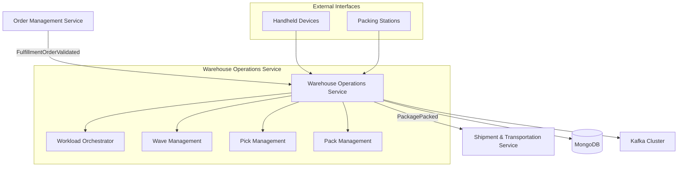
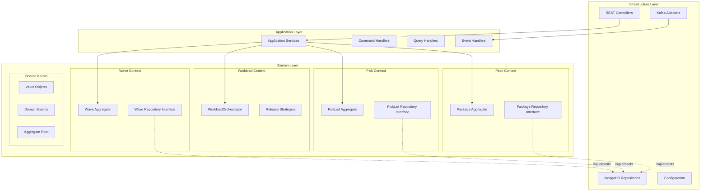
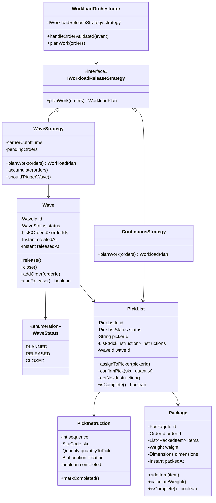
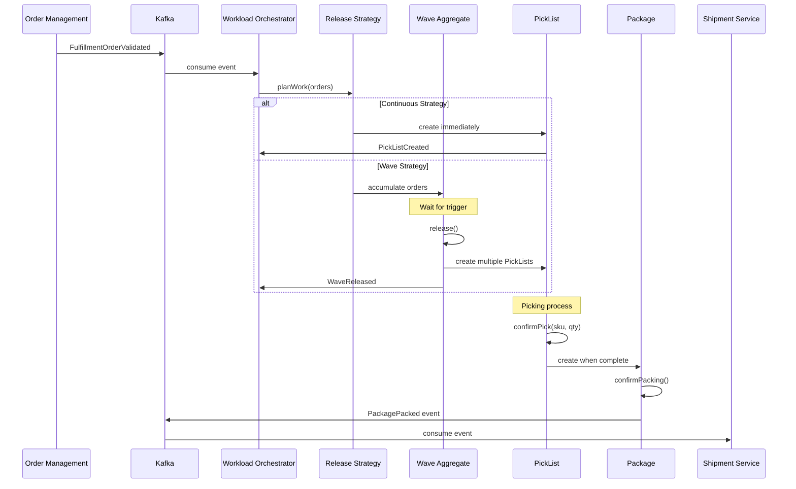
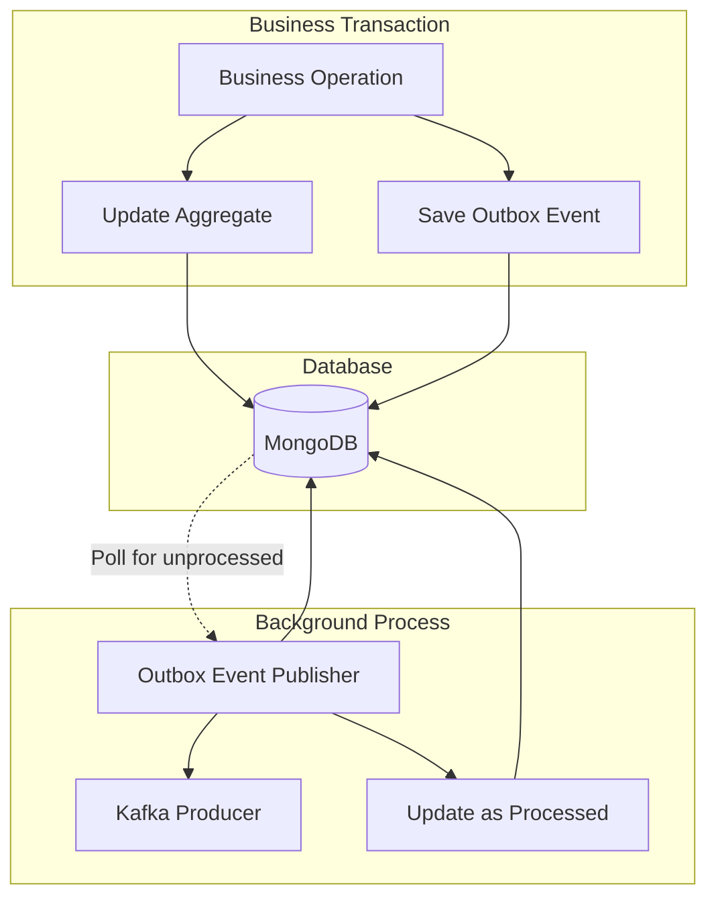
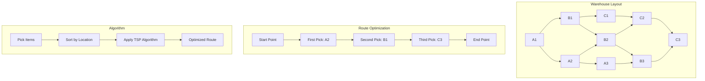
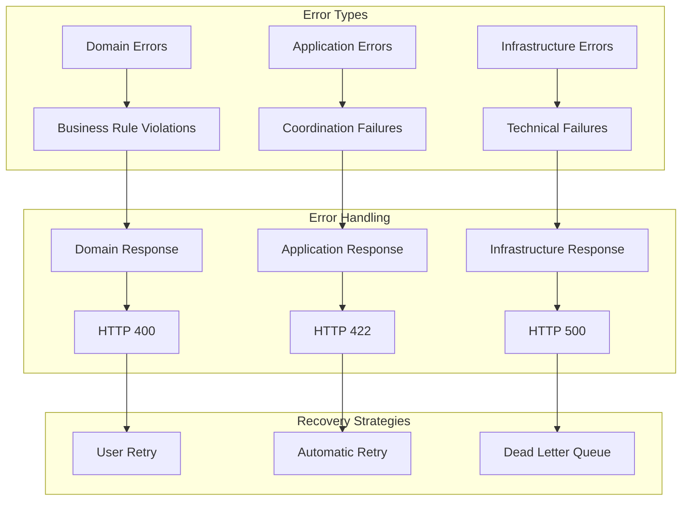
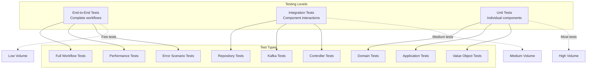
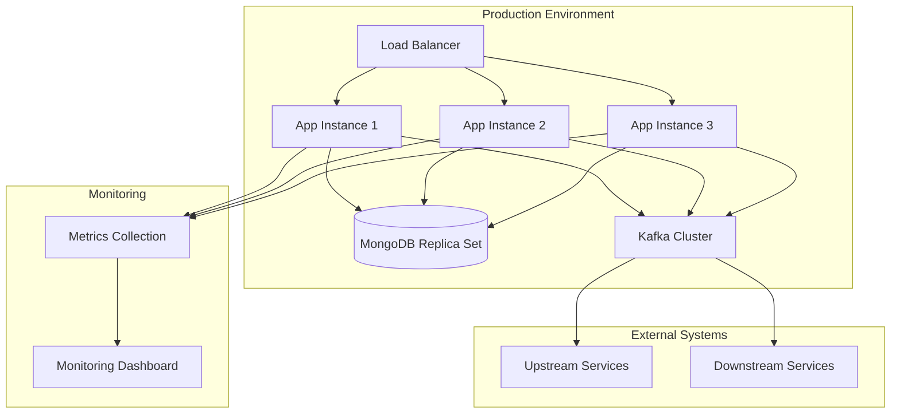

# Warehouse Operations Service - Architecture Diagrams

## System Context Diagram



## Hexagonal Architecture View



## Domain Model - Detailed View



## Event Flow Diagram



## Transactional Outbox Pattern



## Pick Route Optimization



## API Integration Points

```mermaid
graph LR
    subgraph "Inbound"
        Kafka1[Kafka Consumer] --> FO[FulfillmentOrderValidated]
    end
    
    subgraph "Warehouse Operations API"
        FO --> WO[Workload Orchestrator]
        
        subgraph "REST Endpoints"
            WaveAPI[POST /waves/{id}/release]
            PickAPI[POST /pick_lists/{id}/items/confirm_pick]
            PackAPI[POST /packages/{id}/confirm]
        end
        
        WO --> WaveAPI
        WO --> PickAPI
        WO --> PackAPI
    end
    
    subgraph "Outbound"
        PackAPI --> PP[PackagePacked Event]
        PP --> Kafka2[Kafka Producer]
    end
```

## Error Handling Strategy



## Testing Strategy Pyramid



## Deployment Architecture



## Key Architectural Decisions

### 1. Aggregate Sizing Strategy

- **WorkloadOrchestrator**: Single service instance - coordinates all work distribution
- **Wave**: Contains multiple orders bounded by business rules (carrier cutoffs)
- **PickList**: Single picker assignment - atomic unit of picking work
- **Package**: Single order's packed items - complete shipping unit

### 2. Event Consistency Patterns

- **Domain Events**: For intra-service communication between aggregates
- **Integration Events**: For inter-service communication via Kafka
- **Outbox Pattern**: Ensures reliable event publishing with database consistency

### 3. Read/Write Separation

- **Command Side**: Rich domain models with business logic
- **Query Side**: Optimized projections for UI and reporting
- **Event Store**: Audit trail of all domain events

### 4. Error Recovery Mechanisms

- **Transient Failures**: Automatic retry with exponential backoff
- **Business Failures**: User notification with corrective actions
- **System Failures**: Dead letter queue with manual intervention

This architecture ensures:
- ✅ Clear separation of concerns
- ✅ Scalable event-driven design
- ✅ Reliable data consistency
- ✅ Comprehensive error handling
- ✅ Testable component structure