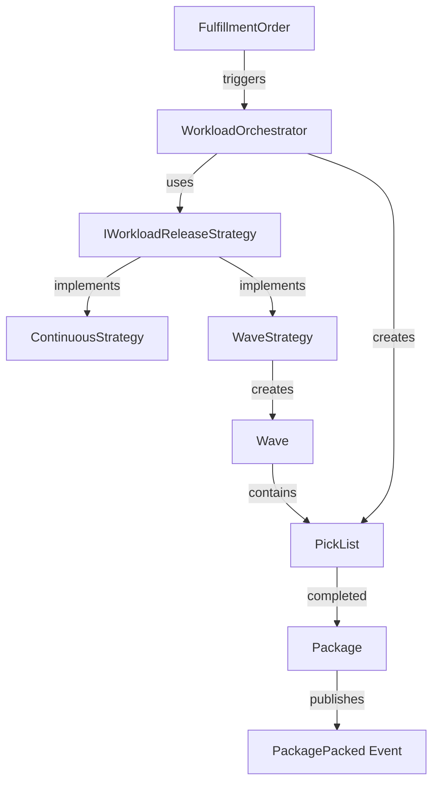

# Warehouse Operations Service - Development Plan

## Overview

This document outlines the detailed development plan for the Warehouse Operations Service, a Spring Boot application implementing Domain-Driven Design (DDD) and Hexagonal Architecture principles. The service manages the physical fulfillment workflow within the warehouse, from receiving validated orders to confirming packed packages ready for shipment.

## Architecture Decisions

### Technology Stack

- **Spring Boot 3.2+** - Latest release for modern Java development
- **Spring Data MongoDB** - Document-based persistence for flexible data models  
- **Apache Kafka** - Event streaming for reliable message processing
- **CloudEvents** - Standardized event format for interoperability
- **Maven** - Dependency management and build tool
- **JUnit 5** - Unit and integration testing framework

### Architectural Patterns

1. **Hexagonal Architecture** - Clear separation between domain logic and external concerns
2. **Domain-Driven Design** - Rich domain models with business invariants
3. **CQRS** - Separate models for commands and queries
4. **Event Sourcing** - Domain events for state changes and integration
5. **Transactional Outbox** - Reliable event publishing with database transactions

## Domain Model

### Core Aggregates



### Aggregate Boundaries

1. **WorkloadOrchestrator** - Central decision-making service
   - Size: Single instance per deployment
   - Justification: Coordinates work distribution, no concurrency conflicts

2. **Wave** - Batch of orders for scheduled processing
   - Size: Contains multiple orders, bounded by carrier cutoff times
   - Justification: Transaction boundary for batch operations, manages state transitions

3. **PickList** - Individual picking assignment
   - Size: Single picker assignment with multiple items
   - Justification: Atomic unit of work for picker, maintains picking state

4. **Package** - Final shipping container
   - Size: Single order's packed items with dimensions/weight
   - Justification: Complete shipping unit, triggers downstream processes

## Implementation Strategy

### Phase 1: Foundation (Tasks 1-7)
- Set up Spring Boot project structure
- Configure MongoDB and Kafka connections
- Create base domain infrastructure
- Implement shared value objects

### Phase 2: Core Domain (Tasks 8-19)
- Implement WorkloadOrchestrator service (WO-03)
- Create strategy pattern infrastructure (WO-04)
- Implement ContinuousStrategy (WO-05)
- Add comprehensive unit tests

### Phase 3: Wave Management (Tasks 20-34)
- Implement Wave aggregate (WO-06)
- Create WaveStrategy for batching (WO-07)
- Add wave release functionality (WO-08)
- Integration testing for wave workflow

### Phase 4: Picking Workflow (Tasks 35-54)
- Route optimization algorithms (WO-09)
- Handheld device APIs (WO-10)
- Barcode scanning integration (WO-11)
- Packing station functionality (WO-12)
- Complete picking workflow tests

### Phase 5: Event Integration (Tasks 55-69)
- Kafka consumer setup (WO-13)
- Event publishing (WO-14)
- Transactional outbox pattern (WO-15)
- End-to-end integration tests

### Phase 6: API Documentation & Polish (Tasks 70-87)
- Update OpenAPI/AsyncAPI specifications
- CloudEvents compliance verification
- Error handling and validation
- Documentation and deployment guides

## Key Design Patterns

### Strategy Pattern for Work Release

```java
public interface IWorkloadReleaseStrategy {
    WorkloadPlan planWork(List<FulfillmentOrder> orders);
}

@Service
public class WorkloadOrchestrator {
    private final IWorkloadReleaseStrategy releaseStrategy;
    
    public WorkloadOrchestrator(IWorkloadReleaseStrategy releaseStrategy) {
        this.releaseStrategy = releaseStrategy;
    }
    
    public void handleOrderValidated(FulfillmentOrderValidated event) {
        // Delegate to configured strategy
        WorkloadPlan plan = releaseStrategy.planWork(List.of(event.getOrder()));
        // Execute the plan
    }
}
```

### Aggregate State Management

```java
public class Wave extends AggregateRoot {
    private WaveId id;
    private WaveStatus status; // PLANNED, RELEASED, CLOSED
    private List<OrderId> orderIds;
    
    public void release() {
        if (status != WaveStatus.PLANNED) {
            throw new IllegalStateException("Wave must be in PLANNED state to release");
        }
        this.status = WaveStatus.RELEASED;
        this.releaseDate = Instant.now();
        
        // Publish domain event
        registerEvent(new WaveReleased(this.id, this.orderIds));
    }
}
```

### Transactional Outbox Pattern

```java
@Transactional
public void processPackageCompletion(Package packageAggregate) {
    // Save aggregate state
    packageRepository.save(packageAggregate);
    
    // Save event to outbox in same transaction
    OutboxEvent event = new OutboxEvent(
        UUID.randomUUID(),
        "PackagePacked",
        packageAggregate.createPackagePackedEvent()
    );
    outboxRepository.save(event);
    
    // Background process will publish events from outbox
}
```

## File Structure

```
src/
├── main/
│   ├── java/com/paklog/warehouse/
│   │   ├── domain/
│   │   │   ├── workload/
│   │   │   │   ├── WorkloadOrchestrator.java
│   │   │   │   ├── IWorkloadReleaseStrategy.java
│   │   │   │   ├── ContinuousStrategy.java
│   │   │   │   └── WaveStrategy.java
│   │   │   ├── wave/
│   │   │   │   ├── Wave.java
│   │   │   │   ├── WaveId.java
│   │   │   │   ├── WaveStatus.java
│   │   │   │   └── WaveRepository.java
│   │   │   ├── picklist/
│   │   │   │   ├── PickList.java
│   │   │   │   ├── PickInstruction.java
│   │   │   │   └── PickListRepository.java
│   │   │   ├── package/
│   │   │   │   ├── Package.java
│   │   │   │   ├── PackedItem.java
│   │   │   │   └── PackageRepository.java
│   │   │   └── shared/
│   │   │       ├── AggregateRoot.java
│   │   │       ├── DomainEvent.java
│   │   │       ├── OrderId.java
│   │   │       ├── SkuCode.java
│   │   │       └── BinLocation.java
│   │   ├── application/
│   │   │   ├── services/
│   │   │   ├── commands/
│   │   │   └── queries/
│   │   └── infrastructure/
│   │       ├── persistence/
│   │       ├── messaging/
│   │       ├── web/
│   │       └── config/
│   └── resources/
│       ├── application.yml
│       └── application-test.yml
└── test/
    ├── java/com/paklog/warehouse/
    │   ├── domain/
    │   ├── application/
    │   └── infrastructure/
    └── resources/
```

## Testing Strategy

### Unit Tests
- Domain aggregate behavior and invariants
- Strategy pattern implementations
- Value object validation
- Command/query handlers

### Integration Tests
- Repository operations with MongoDB
- Kafka message consumption/production
- CloudEvents serialization/deserialization
- API endpoint testing

### End-to-End Tests
- Complete order fulfillment workflow
- Wave processing lifecycle
- Error scenarios and recovery
- Performance under load

## Event Schema Design

### Incoming Events (CloudEvents)

```json
{
  "specversion": "1.0",
  "type": "com.example.fulfillment.order.validated",
  "source": "/fulfillment/order-management-service",
  "subject": "order-123",
  "id": "event-456",
  "time": "2023-12-01T10:00:00Z",
  "datacontenttype": "application/json",
  "data": {
    "order": {
      "order_id": "order-123",
      "shipping_speed_category": "standard",
      "destination_address": {...},
      "items": [...]
    }
  }
}
```

### Outgoing Events (CloudEvents)

```json
{
  "specversion": "1.0",
  "type": "com.example.fulfillment.warehouse.package.packed",
  "source": "/fulfillment/warehouse-operations-service",
  "subject": "package-789",
  "id": "event-101",
  "time": "2023-12-01T12:00:00Z",
  "datacontenttype": "application/json",
  "data": {
    "package": {
      "package_id": "package-789",
      "order_id": "order-123",
      "packed_items": [...],
      "weight": {"value": 2.5, "unit": "kg"},
      "dimensions": {...}
    }
  }
}
```

## Development Guidelines

### Spring Best Practices
1. Constructor-based dependency injection
2. Use `@Service` instead of `@Component`
3. Minimize visibility with `private` modifiers
4. Write testable code with pure functions
5. Follow Single Responsibility Principle

### DDD Guidelines
1. Rich domain models with behavior
2. Aggregate boundaries respect transaction consistency
3. Domain events for inter-aggregate communication
4. Repository interfaces in domain layer
5. Application services coordinate use cases

### Error Handling Strategy
1. Domain exceptions for business rule violations
2. Application exceptions for coordination failures
3. Infrastructure exceptions for technical issues
4. Global exception handler for API responses
5. Comprehensive logging for troubleshooting

## Next Steps

Once this plan is approved, the implementation can begin with Phase 1 (Foundation setup) and progress through each phase systematically. Each task in the todo list provides specific implementation guidance and can be executed independently while maintaining proper dependencies.

The plan ensures:
- ✅ All user stories are covered with detailed tasks
- ✅ Hexagonal architecture principles are followed
- ✅ DDD patterns are properly implemented
- ✅ Spring Boot best practices are applied
- ✅ Comprehensive testing strategy is included
- ✅ CloudEvents integration is properly designed
- ✅ Transactional outbox pattern ensures reliability