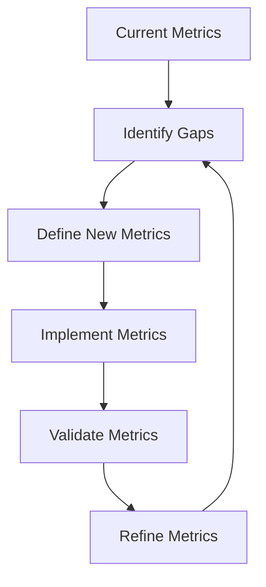

# Warehouse Operations Service - Observability Continuous Improvement Strategy

## Observability Maturity Model

### Level 1: Foundational Monitoring
- Basic metrics collection
- Reactive alerting
- Limited visibility

### Level 2: Enhanced Observability
- Comprehensive metrics
- Distributed tracing
- Proactive alerting

### Level 3: Advanced Observability
- AI-driven insights
- Predictive analytics
- Autonomous optimization

## Continuous Improvement Framework

### 1. Metrics Evolution


### 2. Observability Enhancement Cycle
- **Assess**: Quarterly review of monitoring effectiveness
- **Analyze**: Identify performance bottlenecks
- **Adapt**: Implement targeted improvements
- **Automate**: Create self-healing mechanisms

## Advanced Monitoring Techniques

### Dynamic Metric Generation
```java
@Component
public class AdaptiveMetricsGenerator {
    private final MeterRegistry registry;
    private final MetricsConfigurationService configService;

    public void generateDynamicMetrics() {
        List<MetricDefinition> dynamicMetrics = configService.getDynamicMetrics();
        
        dynamicMetrics.forEach(metricDef -> {
            switch(metricDef.getType()) {
                case COUNTER:
                    Counter.builder(metricDef.getName())
                        .description(metricDef.getDescription())
                        .register(registry);
                    break;
                case GAUGE:
                    Gauge.builder(metricDef.getName(), () -> calculateGaugeValue())
                        .description(metricDef.getDescription())
                        .register(registry);
                    break;
            }
        });
    }
}
```

### Intelligent Alerting Strategy
```yaml
intelligence:
  alerting:
    adaptive-thresholds: true
    machine-learning-model: 
      type: anomaly-detection
      training-data-retention: 90d
    auto-remediation:
      enabled: true
      actions:
        - scale-resources
        - restart-services
        - reroute-traffic
```

## Observability Improvement Roadmap

### Short-Term Goals (0-3 Months)
- [ ] Implement custom domain-specific metrics
- [ ] Enhance trace sampling
- [ ] Develop advanced dashboard visualizations

### Mid-Term Goals (3-6 Months)
- [ ] Integrate machine learning for anomaly detection
- [ ] Implement predictive scaling
- [ ] Create autonomous remediation workflows

### Long-Term Goals (6-12 Months)
- [ ] Develop self-optimizing system
- [ ] Implement AI-driven performance tuning
- [ ] Create predictive maintenance capabilities

## Measurement and Validation

### Key Performance Indicators (KPIs)
1. Mean Time to Detect (MTTD)
2. Mean Time to Resolve (MTTR)
3. Observability Coverage
4. Prediction Accuracy

### Quarterly Review Checklist
- [ ] Metrics relevance assessment
- [ ] Alert noise reduction
- [ ] Performance optimization opportunities
- [ ] New observability technology evaluation

## Tools and Technologies
- Prometheus
- Grafana
- Jaeger
- ELK Stack
- OpenTelemetry
- Kubernetes Metrics Server

## Collaboration and Knowledge Sharing
- Monthly observability workshops
- Incident review sessions
- Continuous learning program

## Contact and Support
- Observability Team: observability@paklog.com
- Slack: #warehouse-ops-observability

## Appendix: Emerging Technologies
- Chaos Engineering
- eBPF Observability
- AI-Driven Monitoring
- Serverless Observability Patterns

## Continuous Learning Resources
- O'Reilly Observability Engineering
- CNCF Observability Landscape
- DevOps and SRE Conferences